# BNPL Project


A full-stack **Buy Now, Pay Later (BNPL)** system based on an **I.O.U-based installment loan model**, built with **Django** and **React.js** with **TypeScript**, using **Micro-Frontend** architecture.

It follows a **Private/Assigned Plan** structure, where merchants assign installment plans to specific customers. The system is also designed to support **Public Plans** in the future, allowing broader plan accessibility beyond individual assignments.

It follows a **Private/Assigned Plan** structure, where merchants assign installment plans to specific customers. The system includes separate **react-admin** panels under ‍‍`customer/*` and `merchant/*`, with login access restricted to the user's account type.

## Frontend Features

### Architecture

- **Micro‑Frontend (Module Federation)** – Runtime loading of independent React apps, enabling parallel development and isolated deployments.
- **Clean Architecture** – Separation into Presentation, Application, Infrastructure and Domain layers to enhance modularity and testability.

### Auth & Data

- **Auth Provider** – JWT authentication flow with automatic access and refresh token handling for secure session management.
- **Data Provider** – React-Admin compatible API client with error handler decorator.

### Testing & Quality

- **Jest** – Comprehensive tests for components and utilities to ensure code reliability.
- **Prettier & ESLint** - Automated code formatting and linting to enforce style consistency and catch errors early.

### Observability

- **OpenTelemetry Integration** – Capturing frontend metrics and traces for end-to-end performance monitoring and sensitive fields in request metadata are automatically redacted to protect personal data.

## Backend Features

### Architecture & Code Design

- **Separated view and service logic** – Follows clean architecture principles, aiding in maintainability and testing.
- **DRF-compatible Standardized API response mixin** – Provides uniform success/error response formats, improving client integration and Swagger docs clarity.
- **Custom DRF exception handler** – Standardizes error responses, making debugging and frontend handling more consistent
- **Base business exception class** – Centralizes business logic exceptions, enabling more structured error handling.
- **Unified paginated list responses** – Ensures consistent pagination output, reducing frontend complexity.
- **Modular Django settings (development/production)** – Simplifies environment-based configuration management with proper type casting.

### Authentication & Permissions

- **Reject tokens if user is inactive** – Enhances security by invalidating access even with a valid token.
- **Custom JWT for skipping expired tokens on public endpoints** – Allows anonymous access without breaking flow, improving public endpoint UX.
- **Custom DRF permission classes** – Improves UX by showing specific access error messages.
- **Object-level permission view mixin** – Provides auto-checks in viewsets with reusable logic

### Tooling

- **Structured logging with JSON format (structlog)** – Supports modern observability tools like ELK or Datadog.
- **FactoryBoy + DRF APITestCase** – Allows fast, isolated, and reusable tests, boosting test coverage and quality.
- **PEP8, typing, and Google docstrings** – Increases code readability, maintainability, and quality.

### API Documentation

- **Swagger schema utilities for response documentation** – Improves API clarity and keeps documentation aligned with real behavior.

### CI/CD & Test Automation

- **Prebuilt Docker image for backend CI** – Reduces CI time by skipping local build and using cached layers.
- **GitHub workflow: backend tests with concurrency rules** – Smart test runs based on event type, skipping unnecessary builds.
- **Test artifacts: logs and coverage reports** – Enhances CI transparency and developer feedback loops.

### Installments & Plans Logic

- **Bulk create installments via thread-local flag for signal** – Optimizes mass insert operations and automates setup logic.
- **Signal for updating installment plan status** – Keeps data integrity by reflecting changes in related models.
- **Installment conflict prevention checks** – Prevents logic bugs like double payments or out-of-sequence transactions.
- **Conditional UniqueConstraint and CheckConstraint** – Enforces business rules at the DB level, protecting data consistency for unique installment sequence and due date per plan with correct amount

### Background Tasks (Celery)

- **Celery tasks for reminders and overdue checks** – Adds scalability by offloading background operations.
- **Separated Celery workers as Docker services** - helps decouple task processing from the main API which improves maintainability, scalability, and fault tolerance of the system.

### User Management

- **Signals for customer/merchant profile creation** – Automates related object creation, ensuring consistency.
- **Auto approve merchants and customer credits in debug mode** – Speeds up development/testing by bypassing manual checks.
- **DRF-based unique email validation + Django password validation** – Ensures secure user creation.
- **Custom UserManager + Support the Group and Permission models** – Enables extensible user creation logic and permission handling.

### DB Models

- **Abstract base model to add timestamps with indexed created_at** – Improves database efficiency for ordering/filtering operations.
- **Future-proof database design with abstracted plan-customer relation** – The system avoids directly linking `Plan -> Customer` to enable future support for Public Plans. Instead, it introduces an intermediate `InstallmentPlan` that connects a `Plan` (owned by a merchant)
to a `User` (the customer), providing flexibility for both assigned and publicly available plans.

## Getting started (Development)

### Prerequisites

Make sure you have the following installed on your system:

- [Docker](https://docs.docker.com/get-docker/)
- [Docker Compose](https://docs.docker.com/compose/install/)

### Step 1: Copy `.env` file to configre

Create a .env file by copying the example configuration:

```bash
cp .env.example .env
```

#### ⚠️ To development set correct file permissions with UID/GID (Optional but recommended)

The containers run using the same **user ID (UID)** and **group ID (GID)** as your host machine, defined via `HOST_UID` and `HOST_GID` in the `.env` file.
This prevents permission issues when writing files (e.g., migrations, logs) from within containers to your local file system.

**Note:** If you're using **Linux** and your UID and GID are both **1000**, which is common for the first local user, you can skip this step — the default values will work just fine.

If you're unsure, you can find your host UID and GID by running:

```bash
id -u && id -g
```

### Step 2: Start backend required services

Use the following command to start **PostgreSQL**, **Redis**, and the **API service**:

```bash
docker compose -f docker-compose.dev.yml up -d bnpl-db bnpl-redis bnpl-api
```

#### ⚠️ Healthchecks Note

Services will only start once their dependencies are marked as healthy.

- **PostgreSQL** has a `pg_isready` check.
- **Redis** uses `redis-cli ping`.

This may _take a few seconds_ depending on your system.

### Step 3: Enter the API container

```bash
docker compose -f docker-compose.dev.yml exec bnpl-api /bin/sh
```

### Step 4: Apply migrations and run the Django development server

Once inside the container, run the following commands to initialize the database:

```bash
python manage.py migrate
```

This applies any outstanding database migrations.

If you may also want to use the Django `admin` dashboard feature, you need to create a superuser:

```bash
python manage.py createsuperuser
```

Afterward, start the Django development server. It binds to `0.0.0.0`, making it accessible from outside the container:

```bash
python manage.py runserver 0.0.0.0:8000
```

**Note:** You only need to run `migrate` the first time or whenever new migrations are added to the project.

### Step 5 (Optional): Start Celery background workers as separate Docker services

The project uses **Celery** to handle asynchronous tasks such as background processing and scheduled jobs.
Running Celery as separate services helps **decouple task processing from the main API**, which improves maintainability, scalability, and fault tolerance of the system.

Start both the **worker** and **beat** services using the following command:

```bash
docker compose -f docker-compose.dev.yml up -d bnpl-worker bnpl-beat
```

### Step 6: Start frontend service

To start the **Node** development environment for **React.js**, use the following command:

```bash
docker compose -f docker-compose.dev.yml up -d bnpl-frontend
```

### Step 7: Enter the frontend container

Run the following command to enter the **frontend** container:

```bash
docker compose -f docker-compose.dev.yml exec bnpl-frontend /bin/sh
```

### Step 4: Install packages and run the development script

Once inside the container, execute the following commands to install the necessary packages and run the development script. (The script will launch with the parallel flag to start remote services and the shell application.)

```bash
pnpm install
pnpm dev
```

- **Shell homepage:** [http://localhost:3000](http://localhost:3000)
- **Customer admin panel:** Accessible under `customer/*`
- **Merchant admin panel:** Accessible under `merchant/*`

**Note:** Users can only log in according to their account type. Login to other account types is restricted.

**Note:** All frontend default settings are located at ‍‍‍

```bash
frontend/shared/src/infrastructure/context/global-settings.context.tsx‍
```

For new **environment** variables, they must be defined with the webpack **DefinePlugin** for both shell and remote apps.

#### Optional: Standalone Development (for development purposes)

- **customer standalone:**

```bash
pnpm dev:standalone --filter @bnpl/merchant-app
```

Customer standalone will be available at: [http://localhost:3001](http://localhost:3001)

**merchant standalone:**

```bash
pnpm dev:standalone --filter @bnpl/customer-app
```

Merchant standalone will be available at: [http://localhost:3002](http://localhost:3002)

### Explore Backend API endpoints via Swagger UI (development environment only)

### Swagger UI

Once the development server is running, you can browse and try all available API endpoints using Swagger UI:

Open: [http://localhost:8000/swagger/](http://localhost:8000/swagger/)

### API endpoints

#### Authentication

`POST /api/auth/register/` — Register a new user (as Customer or Merchant)

`POST /api/auth/token/` — Obtain access and refresh JWT tokens

`POST /api/auth/token/refresh/` — Refresh your access token using a refresh token

---

#### Customers

`GET /api/customers/eligible/` — List eligible customers (merchant-only access) by email search, useful when assigning customer IDs during private plan creation

**Eligible customers definition:**

- The customer's profile must be **active**, meaning they are allowed to use BNPL services
- The customer's credit score status must be set to **approved**

---

#### Installments and Plans

`GET /api/installments/` — list installments with filtering upcoming/past (owner customer-only access)

`POST /api/installments/{id}/pay/` — Pay for a specific installment (owner customer-only access)

`POST /api/plans/` — Create a new installment plan (verified merchant-only access)

 **Features:**

- Installments are created in `bulk`, improving performance and scalability.
- A thread-local flag is used to skip signal-based creation, preventing redundant processing during batch operations.

`GET /api/plans/` — List all existing installment plans for both customers and merchants access

**Customer view:**

- Lists only installment plans associated to the customer.

**Merchant view:**

- Lists only installment plans created by the current merchant.
- includes customer_email field

`GET /api/plans/{id}/` — retrieve the details of a specific installment plan with object-level access for customers and merchants

---

#### Analytics

`GET /api/analytics/dashboard/` — Overview of key business metrics (merchant-only access)

- includes total revenue, success rate, total overdue and total active_plans

---

### Django Admin panel (useful during development)

If you created a superuser, you can access the Django admin interface at:

[http://localhost:8000/admin/](http://localhost:8000/admin/)

- User model includes **inline editing** for CustomerProfile and MerchantProfile.
- Show **clickable links** to the related Plan and Customer (User), for fast navigation and context.

## Project Structure (Backend)

```bash
.
├── bnpl/                  # Django project (settings, wsgi, celery)
├── core/                  # Shared utilities, exceptions, base logic
├── account/               # Authentication, user management
├── customer/              # Customer-related models and logic
├── merchant/              # Merchant models and logic
├── plan/                  # Installment plan logic
├── installment/           # Payment installments
├── analytics/             # Reporting and dashboards
├── notification/          # Notification system
├── requirements.txt
├── requirements-dev.txt
├── manage.py
└── Dockerfile.dev
```

## Project Structure (Frontend)

```bash
.
├── shell/                    # Host app
├── customer-app/             # Remote Customer app
├── merchant-app/             # Remote Merchant app
├── shared/                   # Shared modules and utilities
├── package.json
├── pnpm-workspace.yaml
└── Dockerfile.dev
```

## Backend Tech Stack

| Layer           | Technology                           | Notes                                |
| --------------- | ------------------------------------ | ------------------------------------ |
| **Backend**     | Django 5.2, DRF 3.16, SimpleJWT      | RESTful APIs, Auth (JWT)             |
| **Async Tasks** | Celery 5.5 + Redis                   | Background jobs (e.g. notifications) |
| **Database**    | PostgreSQL 15+ (via psycopg2-binary) | Relational DB                        |
| **Config**      | python-decouple                      | `.env`-based settings                |
| **Logging**     | structlog                            | Structured & readable logging        |
| **API Docs**    | drf-yasg                             | Swagger UI, OpenAPI schema           |
| **CORS**        | django-cors-headers                  | Cross-Origin requests for APIs       |
| **Testing**     | pytest, pytest-django, factory_boy   | Automated unit & integration tests   |
| **DevOps**      | Docker, GitHub Actions               | Containerized app, CI/CD ready       |
| **Scheduling**  | django-celery-beat                   | Periodic task support                |

## Frontend Tech Stack

| Layer              | Technology                           | Notes                              |
| ------------------ | ------------------------------------ | ---------------------------------- |
| **Frontend**       | React 19.1, TypeScript, react-admin  | Admin interfaces                   |
| **Micro-Frontend** | Webpack 5, Module Federation         | Runtime dynamic module loading     |
| **State & Data**   | @tanstack/react-query, axios         | Server state fetching, HTTP client |
| **Routing**        | react-router-dom                     | Client-side routing                |
| **Auth**           | jwt-decode                           | Decode JWTs on client              |
| **Observability**  | OpenTelemetry Web SDK, OTLP exporter | Frontend tracing & metrics         |
| **Testing**        | Jest, @testing-library/react         | Component & integration tests      |
| **Monorepo**       | pnpm workspaces                      | Multi-package management           |


## Demo Walkthrough

### 1. Home Page

The Shell homepage provides two buttons: one for merchants and one for customers. Click on the appropriate button to proceed.

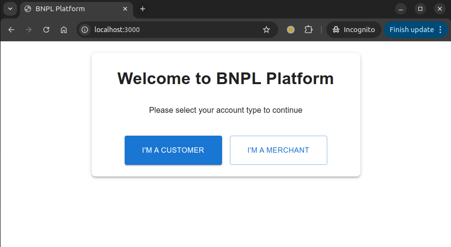
**Shell Homepage:** [http://localhost:3000](http://localhost:3000)

---

### 2. Customer Registration Page

First, register as a customer by creating an account with the email `customer1@example.com`. This account will be used later to assign a plan.

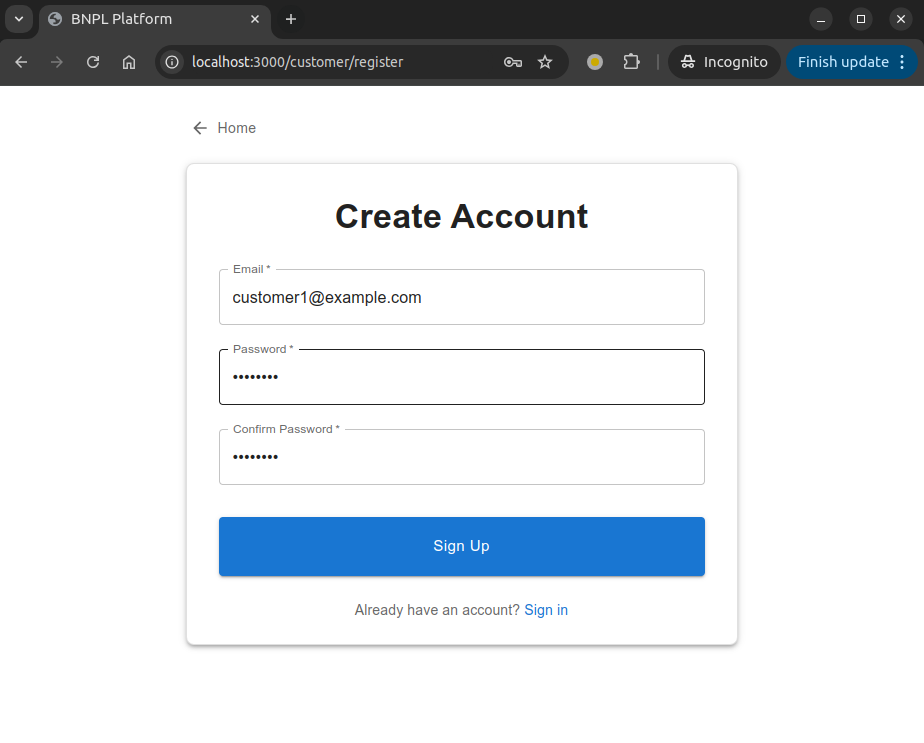
**Customer Registration Page:** [http://localhost:3000/customer/register](http://localhost:3000/customer/register)

---

### 3. Merchant Registration Page

Next, register as a merchant by creating an account with the email `merchant1@example.com`.

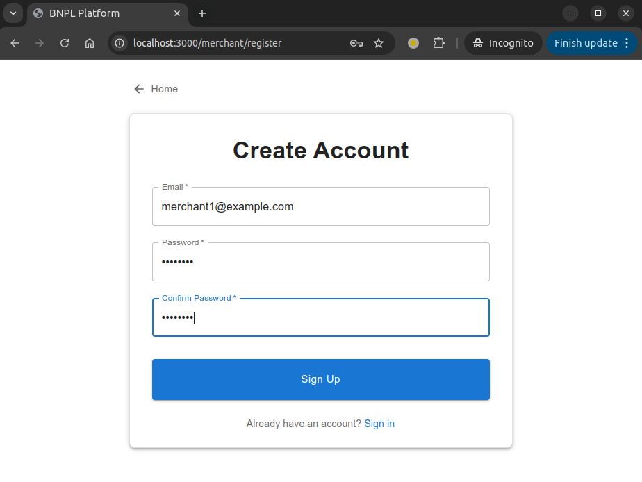
**Merchant Registration Page:** [http://localhost:3000/merchant/register](http://localhost:3000/merchant/register)

---

### 4. Merchant Login Page

Login as a merchant using the account you just created (`merchant1@example.com`).

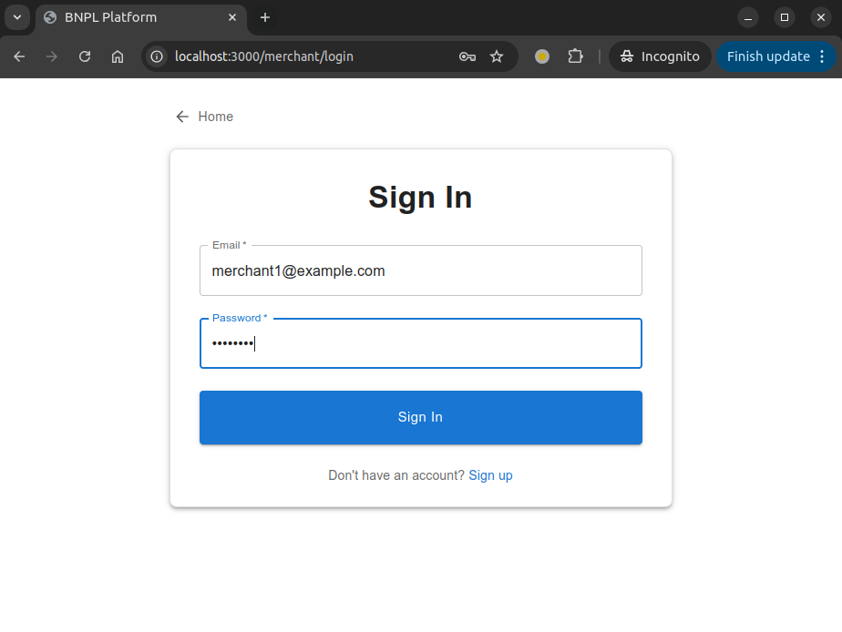
**Merchant Login Page:** [http://localhost:3000/merchant/login](http://localhost:3000/merchant/login)

---

### 5. Merchant Plans Page

As a merchant, navigate to the plans list. Initially, this list will be empty.

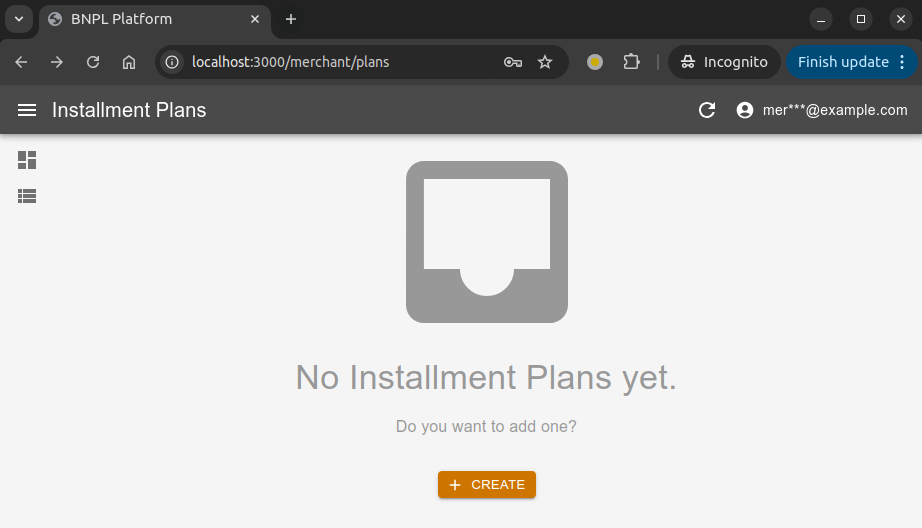
**Merchant Plans Page:** [http://localhost:3000/merchant/plans](http://localhost:3000/merchant/plans)

---

### 6. Create a Plan

To create a new plan, enter the amount. As you type in the `Installment Count`, the preview of installments will appear. Then, start typing the first characters of the customer's email to search and select it.

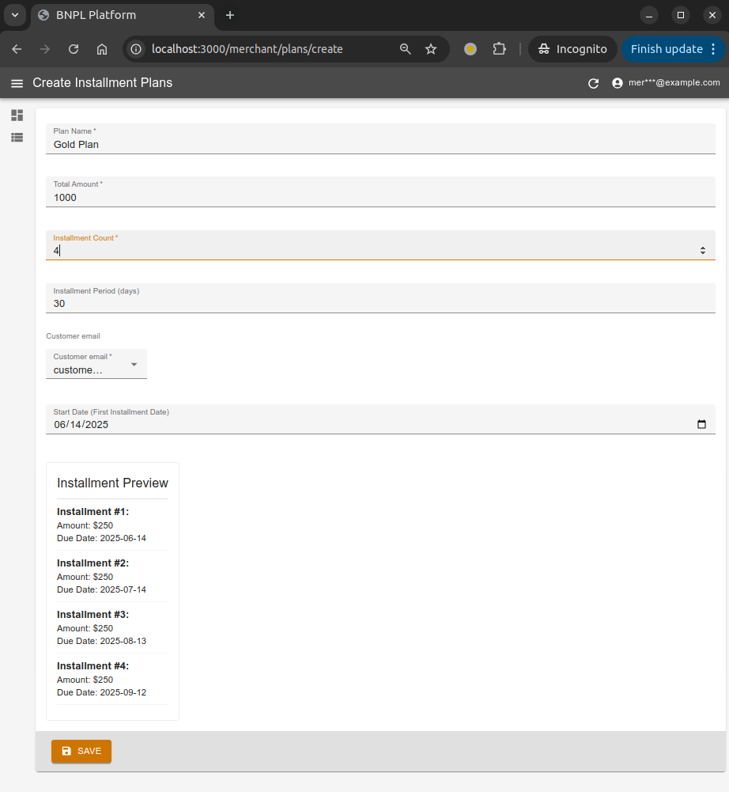
**Create a Plan:** [http://localhost:3000/merchant/plans/create](http://localhost:3000/merchant/plans/create)

---

### 7. Plan Details

After successfully creating the plan, you will be redirected to the plan details page.

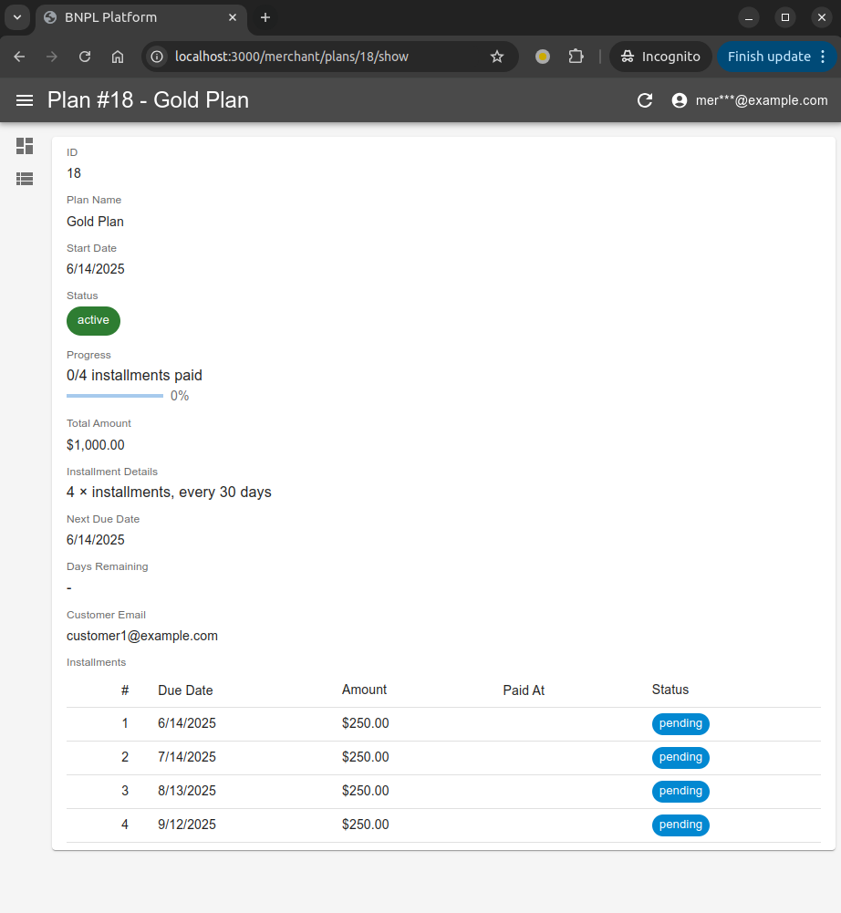

---

### 8. Login as Customer to View Installments

Login with the customer account `customer1@example.com` to view the installments, also you can filter them with upcoming/past status.

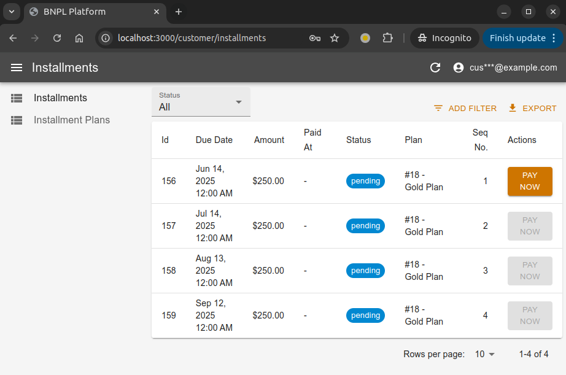
**Customer Installments Page:** [http://localhost:3000/customer/installments](http://localhost:3000/customer/installments)

---

### 9. Click on 'Pay Now'

On the customer installments page, click the `Pay Now` button to initiate payment.

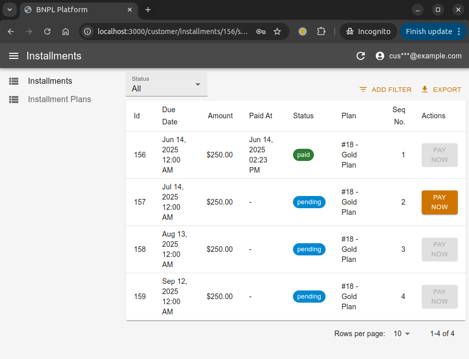

---

### 10. Merchant Dashboard Update

Login as a merchant to see the updated metrics in the merchant dashboard after the customer has made a payment.

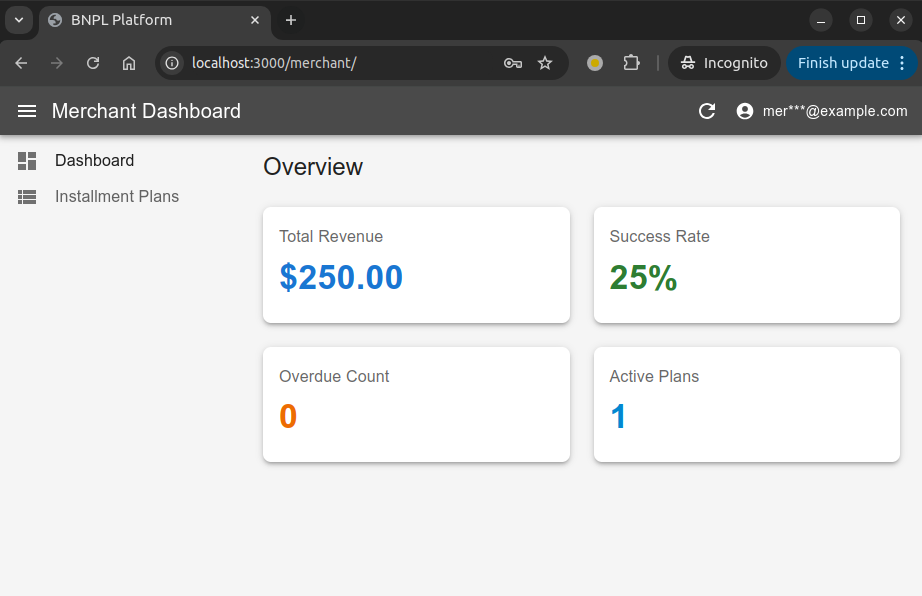
**Merchant Dashboard:** [http://localhost:3000/merchant/](http://localhost:3000/merchant/)

---

### 11. Merchant Plans List with Progress

Finally, view the updated merchant plans list, which now shows the progress for each plan.

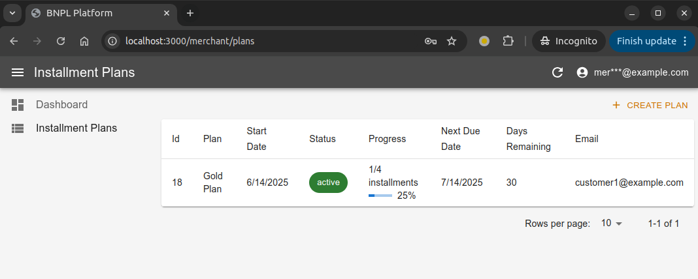
**Merchant Plans Page:** [http://localhost:3000/merchant/plans](http://localhost:3000/merchant/plans)
